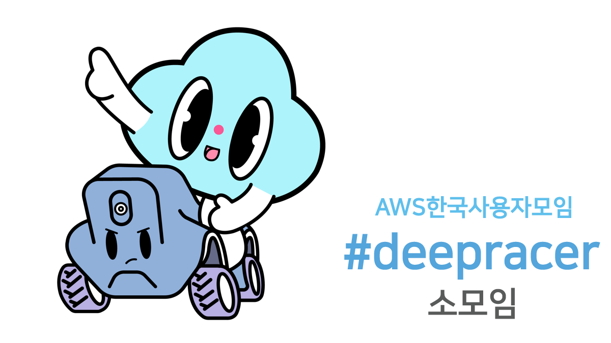
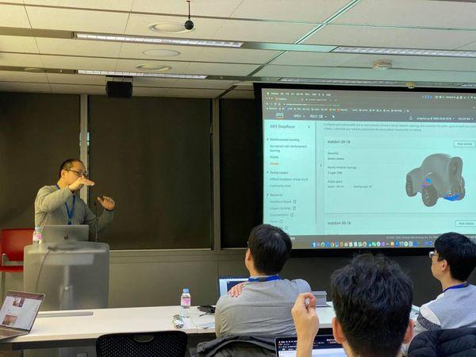
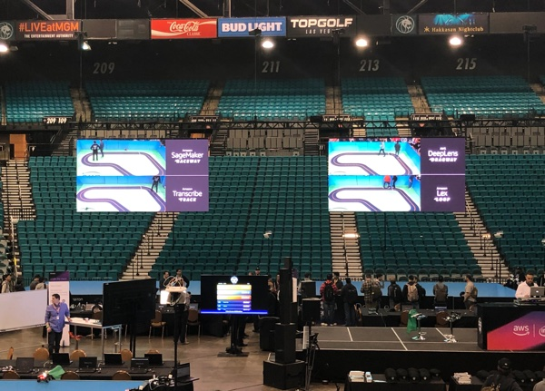
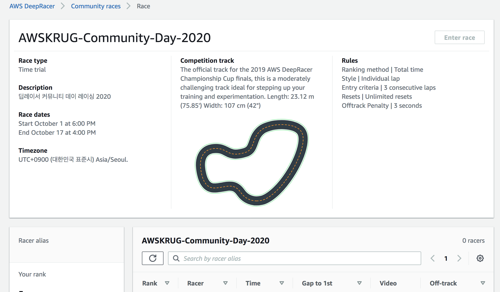
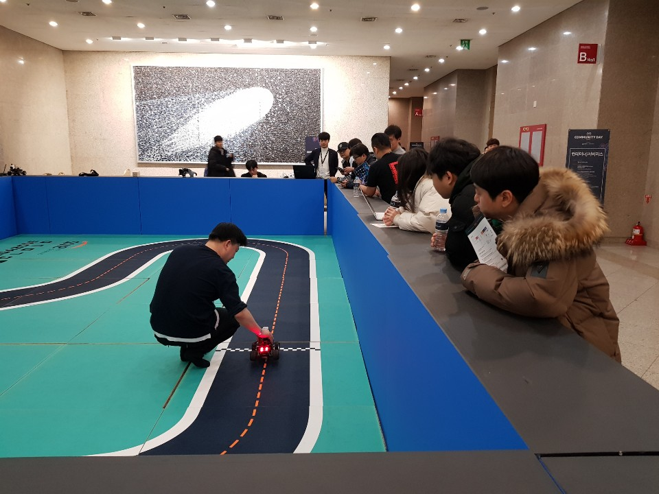
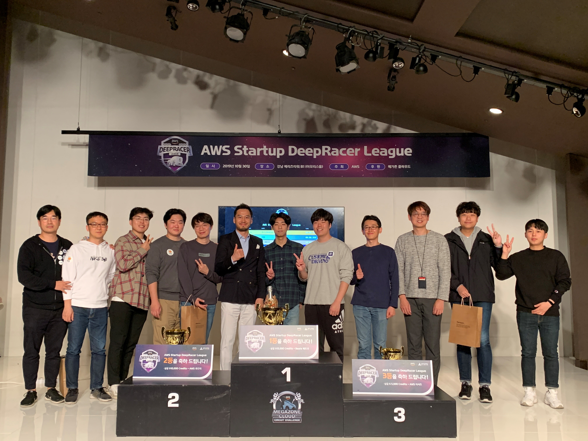
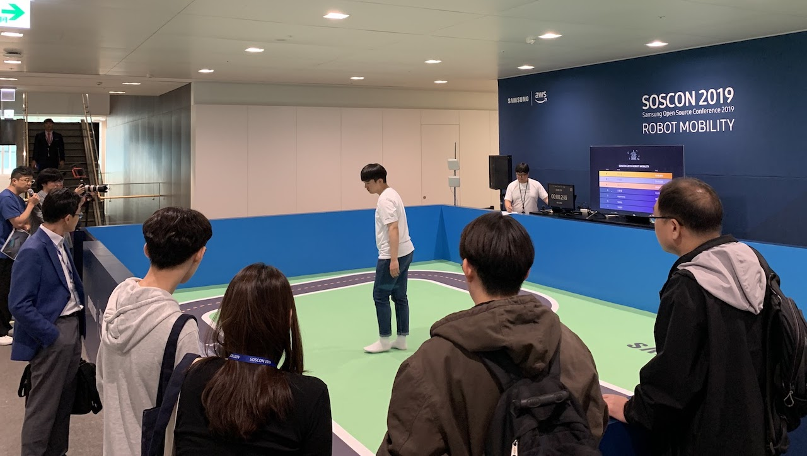
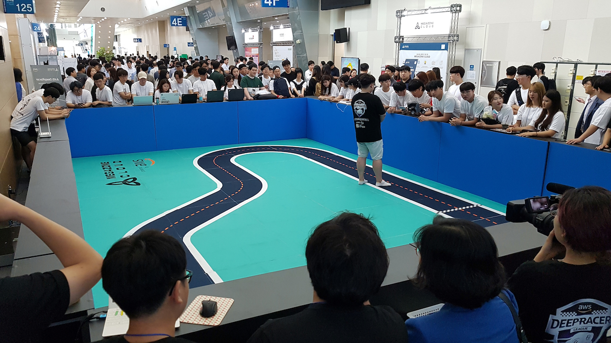
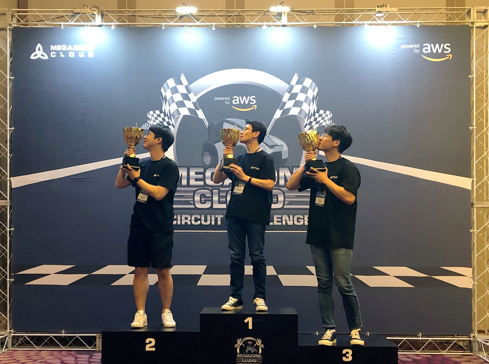

# AWSKRUG DeepRacer Group

AWSKRUG DeepRacer Group is hosting community-driven Deepracer leagues and support offline deepracer leagues in Korea. Also, we research Deepracer devices and reward functions for new formats of AWS DeepRacer.

## Meetups

### AWSKRUG #DeepRacer 소모임 (2023년 8월 17일)
* 딥레이서 알고리즘 이해와 재미있는 실험들 / 이동재 님 (AI Castle)
* https://www.meetup.com/awskrug/events/295062231/

### AWSKRUG #DeepRacer 소모임 (2022년 4월 5일)
* 딥레이서 로컬트레이닝으로 비용을 줄여보자! / 장문기님 (SK(주) C&C)
* https://www.meetup.com/awskrug/events/284545235/

### AWSKRUG #DeepRacer 소모임 (2022년 2월 22일)
* 60분+5분 훈련으로 상위 10% / 유정열님 (당근마켓, AWS Hero)
* https://www.meetup.com/awskrug/events/283759906/

### AWSKRUG #DeepRacer 소모임 (2020년 10월 7일)
* 딥레이서 기록 향상 시키기 / 유정열 (당근마켓)
* https://www.meetup.com/awskrug/events/273473112/
* https://www.youtube.com/watch?v=lCxqupveSGQ

### AWSKRUG #DeepRacer 소모임 (2020년 9월 23일)
* 딥레이서 실전 보상 함수 / 유정열 (당근마켓)
* https://www.meetup.com/awskrug/events/273087588/
* https://www.youtube.com/watch?v=Y5qen_ySiHQ

### AWSKRUG #DeepRacer 소모임 (2020년 9월 16일)
* 딥레이서 시작하기 / 유정열 (당근마켓)
* https://www.meetup.com/awskrug/events/273087411/
* https://www.youtube.com/watch?v=LXepqppNmBM

### DeepRacer 2019 트랙에서 훈련하기 (2020년 1월 20일)
* </img>
* DeepRacer 2019 트랙에서 훈련하기 / 유정열 (메가존클라우드)
* https://www.meetup.com/awskrug/events/267684200/

### DeepRacer Getting Strated (2019년 3월 29일)
* </img>
* 코드 한줄도 안고치고 딥레이서 레이싱 3위 했던 이야기 / 정창훈 (당근마켓 CTO)
* SageMaker 와 RoboMaker 로 딥레이서 훈련시키기 / 유정열 (베스핀글로벌)
* https://www.meetup.com/awskrug/events/259976734/

## Community Leagues

### AWS Community Day 2022 Online
* https://dracer.io/league/cday-2022

### AWS Community Day 2021 Online
* https://dracer.io/league/community-day-2021

### AWS Community Day 2020 Online
* </img>
* </img>
* https://pages.awscloud.com/aws-community-day-online-2020.html
* https://dracer.io/league/community-day-2020

### AWS Community Day 2020 Seoul
* </img>
* https://www.megazone.com/eventreview_20200121_aws_community_day/
* https://dracer.io/league/cday-2020

### AWS Startup DeepRacer League 2019
* </img>
* https://www.megazone.com/191030_aws-strat-up-deepracer-league/
* https://dracer.io/league/startup-2019

### Samsung Open Source Conference 2019
* </img>
* https://www.sosconhistory.net/soscon2019/index.html
* https://dracer.io/league/soscon-2019

### AWS Cloud in Busan DeepRacer League 2019
* </img>
* https://www.megazone.com/20190910_eventreview_aws_cloud_day_in_busan/
* https://dracer.io/league/busan-1909

### AWSKRUG DeepRacer Group League 2019
* </img>
* https://sukjae.github.io/posts/awskrug-deepracer-lecture

### Megazone DeepRacer Challenge 2019
* 
* </img>
* https://www.megazone.com/20190705_blog_deepracer/
